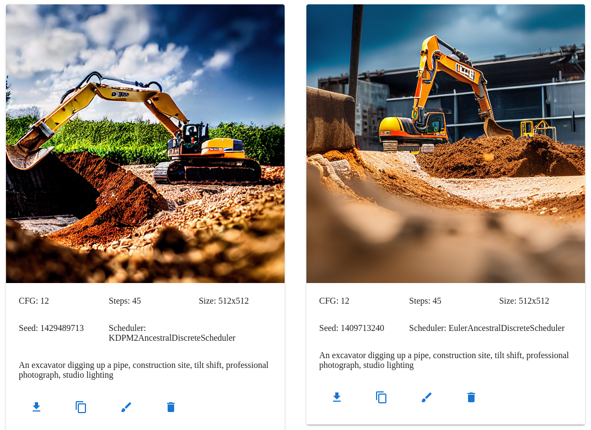

# User Guide

This is the user guide for onnx-web, a web GUI for running ONNX models with hardware acceleration on both AMD and Nvidia
system, with a CPU software fallback.

The API is written in Python and runs on both Linux and Windows and provides access to the major functionality of
diffusers, along with metadata about the available models and accelerators, and the output of previous runs. Hardware
acceleration is supported on both AMD and Nvidia for both Linux and Windows, with a CPU fallback capable of running on
laptop-class machines.

The GUI is written in Javascript, hosted on Github Pages, and runs in all major browsers, including on mobile devices.
It allows you to select the model and accelerator being used for each image pipeline. Image parameters are shown for
each of the major modes, and you can either upload or paint the mask for inpainting and outpainting. The last few output
images are shown below the image controls, making it easy to refer back to previous parameters or save an image from
earlier.

Please see [the server admin guide](server-admin.md) for details on how to configure and run the server.

## Contents

- [User Guide](#user-guide)
  - [Contents](#contents)
  - [Outline](#outline)
    - [What is onnx-web (and what it is not)](#what-is-onnx-web-and-what-it-is-not)
    - [Modes and tabs](#modes-and-tabs)
    - [Image history](#image-history)
    - [Scheduler comparison](#scheduler-comparison)
    - [Model and network types](#model-and-network-types)
  - [Prompts](#prompts)
    - [General structure](#general-structure)
    - [Useful keywords](#useful-keywords)
    - [Prompt tokens](#prompt-tokens)
      - [LoRA and LyCORIS tokens](#lora-and-lycoris-tokens)
      - [Embedding (Textual Inversion) tokens](#embedding-textual-inversion-tokens)
      - [Prompt stages](#prompt-stages)
      - [Region tokens](#region-tokens)
      - [Reseed tokens (region seeds)](#reseed-tokens-region-seeds)
      - [CLIP skip tokens](#clip-skip-tokens)
      - [Grid mode tokens](#grid-mode-tokens)
    - [Long prompt weighting syntax](#long-prompt-weighting-syntax)
  - [Pipelines](#pipelines)
    - [ControlNet pipeline](#controlnet-pipeline)
    - [img2img pipeline](#img2img-pipeline)
    - [Inpaint pipeline](#inpaint-pipeline)
    - [Long prompt weighting pipeline](#long-prompt-weighting-pipeline)
    - [Panorama pipeline](#panorama-pipeline)
    - [Instruct pix2pix pipeline](#instruct-pix2pix-pipeline)
    - [Txt2Img pipeline](#txt2img-pipeline)
    - [Upscale pipeline](#upscale-pipeline)
  - [Tabs](#tabs)
    - [Txt2img tab](#txt2img-tab)
      - [Scheduler parameter](#scheduler-parameter)
      - [Eta parameter](#eta-parameter)
      - [CFG parameter](#cfg-parameter)
      - [Steps parameter](#steps-parameter)
      - [Seed parameter](#seed-parameter)
      - [Batch size parameter](#batch-size-parameter)
      - [Tile size parameter](#tile-size-parameter)
      - [UNet overlap parameter](#unet-overlap-parameter)
        - [25% overlap](#25-overlap)
        - [50% overlap](#50-overlap)
      - [UNet tile size parameter](#unet-tile-size-parameter)
      - [Tiled VAE parameter](#tiled-vae-parameter)
      - [VAE overlap parameter](#vae-overlap-parameter)
      - [VAE tile size parameter](#vae-tile-size-parameter)
      - [Prompt parameter](#prompt-parameter)
      - [Negative prompt parameter](#negative-prompt-parameter)
      - [Width and height parameters](#width-and-height-parameters)
      - [Highres parameters](#highres-parameters)
        - [Highres steps parameter](#highres-steps-parameter)
        - [Highres scale parameter](#highres-scale-parameter)
        - [Highres strength parameter](#highres-strength-parameter)
        - [Highres upscaler parameter](#highres-upscaler-parameter)
        - [Highres iterations parameter](#highres-iterations-parameter)
      - [Upscale and correction parameters](#upscale-and-correction-parameters)
      - [Grid mode parameters](#grid-mode-parameters)
        - [Grid column parameter](#grid-column-parameter)
        - [Grid row parameter](#grid-row-parameter)
    - [Img2img tab](#img2img-tab)
      - [Img2img source image](#img2img-source-image)
      - [Strength parameter](#strength-parameter)
    - [Inpaint tab](#inpaint-tab)
      - [Inpaint source image](#inpaint-source-image)
      - [Mask canvas and brush parameters](#mask-canvas-and-brush-parameters)
      - [Mask filter parameter](#mask-filter-parameter)
      - [Noise source parameter](#noise-source-parameter)
      - [Outpaint parameters](#outpaint-parameters)
    - [Upscale tab](#upscale-tab)
      - [Upscale scale parameter](#upscale-scale-parameter)
      - [Upscale outscale parameter](#upscale-outscale-parameter)
      - [Upscale denoise parameter](#upscale-denoise-parameter)
      - [Correction strength parameter](#correction-strength-parameter)
      - [Correction outscale parameter](#correction-outscale-parameter)
      - [Correction order parameter](#correction-order-parameter)
    - [Blend tab](#blend-tab)
    - [Models tab](#models-tab)
    - [Settings tab](#settings-tab)
      - [Image history setting](#image-history-setting)
      - [API server setting](#api-server-setting)
      - [Reset tab buttons](#reset-tab-buttons)
  - [Adding your own models](#adding-your-own-models)
    - [Model names](#model-names)
    - [Model sources](#model-sources)
      - [Downloading models from Civitai](#downloading-models-from-civitai)
      - [Downloading models from HuggingFace](#downloading-models-from-huggingface)
      - [Pre-converted models](#pre-converted-models)
    - [Using a custom VAE](#using-a-custom-vae)
    - [Optimizing models for lower memory usage](#optimizing-models-for-lower-memory-usage)
    - [Permanently blending additional networks](#permanently-blending-additional-networks)
    - [Extras file format](#extras-file-format)
  - [Environment variables](#environment-variables)
  - [Known errors](#known-errors)
    - [Check scripts](#check-scripts)
      - [Check environment script](#check-environment-script)
      - [Check model script](#check-model-script)
    - [Client errors](#client-errors)
      - [Error fetching server parameters](#error-fetching-server-parameters)
      - [Parameter version error](#parameter-version-error)
      - [Distorted and noisy images](#distorted-and-noisy-images)
      - [Scattered image tiles](#scattered-image-tiles)
    - [Server errors](#server-errors)
      - [Very slow with high CPU usage, max fan speed during image generation](#very-slow-with-high-cpu-usage-max-fan-speed-during-image-generation)
      - [Connection refused or timeouts](#connection-refused-or-timeouts)
      - [Error: name 'cmd' is not defined](#error-name-cmd-is-not-defined)
      - [CUDA driver version is insufficient for CUDA runtime version](#cuda-driver-version-is-insufficient-for-cuda-runtime-version)
      - [Command 'python' not found or Command 'pip' not found](#command-python-not-found-or-command-pip-not-found)
      - [AttributeError: module 'numpy' has no attribute 'float'](#attributeerror-module-numpy-has-no-attribute-float)
      - [Numpy invalid combination of arguments](#numpy-invalid-combination-of-arguments)
      - [ONNXRuntimeError: The parameter is incorrect](#onnxruntimeerror-the-parameter-is-incorrect)
      - [The expanded size of the tensor must match the existing size](#the-expanded-size-of-the-tensor-must-match-the-existing-size)
      - [Shape mismatch attempting to re-use buffer](#shape-mismatch-attempting-to-re-use-buffer)
      - [Cannot read properties of undefined (reading 'default')](#cannot-read-properties-of-undefined-reading-default)
      - [Missing key(s) in state\_dict](#missing-keys-in-state_dict)
      - [Missing MIopen.so.1](#missing-miopenso1)
      - [ValueError: Required inputs (\['text\_embeds', 'time\_ids'\]) are missing from input feed (\['sample', 'timestep', 'encoder\_hidden\_states'\])](#valueerror-required-inputs-text_embeds-time_ids-are-missing-from-input-feed-sample-timestep-encoder_hidden_states)
  - [Output Image Sizes](#output-image-sizes)

## Outline

### What is onnx-web (and what it is not)

onnx-web is a responsive web GUI, in both style and performance, for running ONNX models using hardware acceleration on
any reasonable platform (one with sufficient memory for the models, that can build scipy within 24 hours, etc).

The client should do some reasonable validation of input parameters should be done, such as prompt length, pipeline and
scheduler combinations, and output size. Tabs and options should be disabled when they are not compatible with the
selected models.

Models should be run with hardware acceleration whenever possible, even if that means converting the data files and
helpers. When models cannot be run using the available hardware providers, a CPU fallback should be available to
provide the same features across as many platforms as possible.

The API should be easy to use with command line tools, for testing and in real usage. It should behave well when placed
behind a load balancer, restrictive firewall (including restrictions on outgoing traffic), and when being used by more
people than there are available GPU resources. It should be easy to run on a laptop or use in a hosted notebook.

This is _not_ a general purpose image editor. There are better tools for that already. The inpainting and blending tabs
will need a simple drawing component, but anything more complicated, like layers and blending modes, should be done in
the Gimp, Krita, or Photoshop.

This is _not_ a tool for building new ML models. While I am open to some training features, like Dreambooth and anything
needed to convert models, that is not the focus and should be limited to features that support the other tabs.

### Modes and tabs

- [txt2img](#txt2img-tab)
  - generate a new image from a text prompt
- [img2img](#img2img-tab)
  - modify an existing image using a text prompt
- [inpaint](#inpaint-tab)
  - modify parts of an existing image using an opacity mask
  - includes [outpaint](#outpaint-parameters)
- [upscale](#upscale-tab)
  - resize an existing image

### Image history

Below the tab control is the image history section. The [image history setting](#image-history-setting) controls the
number of images that are shown. You can use the controls in each image card to download the output, copy to the
source image parameters for [img2img](#img2img-source-image) and [inpaint](#inpaint-source-image), and delete the
image from history if you don't like it.

> An astronaut eating a hamburger


### Scheduler comparison

The Stable Diffusion pipeline can be run using different schedulers, which generally produce similar results but
each have their own advantages. Some schedulers are faster than other or require fewer steps, especially the recent
DEIS multistep and Euler Ancestral schedulers.

- https://huggingface.co/docs/diffusers/main/en/using-diffusers/schedulers#compare-schedulers
- https://i.imgur.com/2pQPgf0.jpeg

> An excavator digging up a pipe, construction site, tilt shift, professional photograph, studio lighting



### Model and network types

The [ONNX runtime](https://onnxruntime.ai/) is a library for accelerating neural networks and machine learning models,
using [the ONNX file format](https://onnx.ai/) to share them across different platforms. onnx-web is a server to run
hardware-accelerated inference using those models and a web client to provide the parameters and view the results.

The models used by onnx-web are split up into four groups:

1. Diffusion
   1. general models like [Stable Diffusion](https://huggingface.co/runwayml/stable-diffusion-v1-5)
   2. specialized models like [Knollingcase](https://huggingface.co/Aybeeceedee/knollingcase) or
      [OpenJourney](https://huggingface.co/prompthero/openjourney)
2. Upscaling
   1. [BSRGAN](https://github.com/cszn/BSRGAN)
   2. [Real ESRGAN](https://github.com/xinntao/Real-ESRGAN)
   3. [Stable Diffusion](https://huggingface.co/stabilityai/stable-diffusion-x4-upscaler)
   4. [SwinIR](https://github.com/JingyunLiang/SwinIR)
3. Correction
   1. [CodeFormer](https://github.com/sczhou/CodeFormer)
   2. [GFPGAN](https://github.com/TencentARC/GFPGAN)
4. Networks
   1. [LoRA](https://arxiv.org/abs/2106.09685) and [LyCORIS](https://github.com/KohakuBlueleaf/LyCORIS)
   2. [Textual Inversion](https://textual-inversion.github.io/)

There are many other models available and specialized variations for anime, TV shows, and all sorts of other styles. You
can [add your own models](#adding-your-own-models) from many sources, including [the HuggingFace hub
](#downloading-models-from-huggingface) and [Civitai](#downloading-models-from-civitai).

## Prompts

### General structure

Building a good prompt is like telling a short story without any of the articles and other small words (a/an, of, the).
The subject and more important keywords should often come first, along with any specific camera angle or lens that you
want to use. More generic keywords about quality and resolution can come towards the end. Adjectives about a noun
should usually come before the nouns they describe, like "denim shirt" rather than "shirt made of denim." Try using
figurative keywords as well as literal ones, especially with colors and textures, and include emotions for people.

Things you can describe include:

- the subject, their pose, and facial expression
- the camera, lens, and angle used
- lighting mood and intensity
- depth of focus and amount of detail in the background

Some prompts may not always be successful and may require a few images to get the result you want. If you still aren't
seeing the image you have imagined, try adjusting [the CFG parameter](#cfg-parameter) and iterate on the prompt - add
more keywords to describe the missing parts of the image and try moving them around, putting the focal objects first.

### Useful keywords

The [OpenArt Stable Diffusion Prompt Book](https://cdn.openart.ai/assets/Stable%20Diffusion%20Prompt%20Book%20From%20OpenArt%2011-13.pdf)
has a lot of useful tips on how to build a good prompt. You can include keywords to describe the subject, setting,
style, and level of detail. Throwing a few extra keywords into the end of the prompt can help add specific details,
like the color and intensity of the lighting.

Keywords:

- color
  - bright
  - colorful
  - cool
  - dark
  - deep
  - dusky
  - light
  - warm
  - iridescent
  - translucent
- lighting
  - candlelight
  - cinematic lighting
  - firelight
  - diffused|dramatic|soft lighting
  - neon lights
  - reflection
  - refraction
  - volumetric lighting
- material
  - brass
  - crystal
  - earth
  - glass
  - iron
  - magma
  - marble
  - porcelain
  - wood
- medium
  - 3d render
  - digital illustration
  - oil painting
  - pastel drawing
  - pencil sketch
  - pen and ink
  - sculpture
  - watercolor painting
- photography
  - backlighting
  - bloom
  - bokeh
  - broad light
  - chromatic aberration
  - shallow|deep depth of field
  - fish-eye
  - smooth|sharp|shallow focus
  - god rays, sun rays, sun shafts
  - HDR
  - RAW color
  - wide-angle
  - tilt-shift
  - tone-mapped
- quality & resolution
  - 4k
  - 8k
  - exquisite
  - fine detail
  - highly detailed
  - masterpiece
  - Octane render
  - realistic
  - Unreal Engine
- style
  - abstract
  - art nouveau
  - classical
  - gothic
  - graffiti
  - hyperrealism
  - modernism
  - realistic
  - surreal
- subject
  - ancient
  - cyberpunk
  - futuristic
  - isometric
  - lush
  - medieval

Examples:

- 4k, HDR, smooth, sharp focus, high resolution, photorealistic, detailed
- 8k, HDR, shallow depth of field, broad light, high contrast, backlighting, bloom, light sparkles, chromatic
  aberration, sharp focus, RAW color photo

Links:

- https://stable-diffusion-art.com/how-to-come-up-with-good-prompts-for-ai-image-generation
- https://contentwritertools.com/stable-diffusion-prompt-guide
- https://www.klartai.com/post/best-stable-diffusion-midjourney-prompt-a-comprehensive-guide-to-text-to-image-generation
- https://getimg.ai/guides/guide-to-negative-prompts-in-stable-diffusion

### Prompt tokens

You can blend extra networks with the diffusion model using `<type:name:weight>` tokens. There are menus in the
client for each type of additional network, which will insert the token for you.

The `type` must be one of `clip`, `inversion`, or `lora`.

The `name` must be alphanumeric and must not contain any special characters other than `-` and `_`.

The `weight` must be a number. For `clip`, it must be a positive integer. For `inversion` and `lora`, it can be an
integer or decimal number and may be negative.

#### LoRA and LyCORIS tokens

You can blend one or more [LoRA weights](https://arxiv.org/abs/2106.09685) with the ONNX diffusion model using a
`lora` token:

```none
<lora:name:0.5>
```

LoRA models must be placed in the `models/lora` directory and may be any supported tensor format.

The type of network, name, and weight must be separated by colons. The LoRA name must be alphanumeric and must not
contain any special characters other than `-` and `_`.

LoRA weights often have their own keywords, which can be found on their model card or Civitai page. You need to use
the `<lora:name:1.0>` token _and_ the keywords to activate the LoRA.

Check out [the `kohya-ss/sd-scripts` repository](https://github.com/kohya-ss/sd-scripts) for more details.

#### Embedding (Textual Inversion) tokens

You can blend one or more [Textual Inversions](https://textual-inversion.github.io/) with the ONNX diffusion model
using the `embeddings` token _and_ one or more layer token:

```none
<inversion:autumn:1.0> autumn, ...
<embeddings:autumn:1.0> autumn, ...
```

The `<inversion:name:weight>` token is a synonym for `<embeddings:name:weight>` and operates exactly the same way.

Textual Inversion embeddings must be placed in the `models/inversion` directory regardless of which token you use, and
may be any supported tensor format.

The type of network, name, and weight must be separated by colons. The Textual Inversion name must be alphanumeric
and must not contain any special characters other than `-` and `_`.

Once the Textual Inversion has been blended, you can activate some or all of its layers using the trained token(s)
in your prompt. Every Textual Inversion is available using its name, as well as tokens for all of the layers and for
each individual layer. For an embedding called `autumn`, the available tokens are:

- `autumn`
- `autumn-all`
- `autumn-0` through `autumn-5`

The `autumn` and `autumn-all` tokens both activate a layer with the sum weights of the others. This will have a
similar effect, but will not represent as many tokens in the prompt and may not attract as much attention. You need to
use the `<inversion:name:1.0>` token _and_ the layer tokens to activate the Textual Inversion.

You can use a range of the numbered layer tokens using the `base-{X,Y}` syntax in your prompt, where `X` is inclusive
and `Y` is not. The range `autumn-{0,5}` will be expanded into the tokens `autumn-0 autumn-1 autumn-2 autumn-3 autumn-4`.
You can provide a step as the third parameter, which will skip layers: `even-layers-{0,100,2}` will be expanded into
`even-layers-0 even-layers-2 even-layers-4 even-layers-6 ... even-layers-98`. Some Textual Inversions only have a
single layer and some have 75 or more. You can use the layer tokens individually, out of order, and repeat some layers
or omit them entirely.

_Note:_ The token range syntax currently does not work when [long prompt weighting](#long-prompt-weighting) is enabled.

Some Textual Inversions have their own token, especially ones trained using [the Stable Conceptualizer notebook
](https://colab.research.google.com/github/huggingface/notebooks/blob/main/diffusers/stable_conceptualizer_inference.ipynb)
and [the sd-concepts-library](https://huggingface.co/spaces/sd-concepts-library/stable-diffusion-conceptualizer) on
HuggingFace hub. The model card should list the token, which will usually be wrapped in `<angle-brackets>`. This token
will be available along with the name token, but these concepts only have a single layer, so the numbered tokens are
much less useful. For a concept called `cubex` with the token `<cube>`, the available tokens are:

- `cubex`
- `<cube>`
- `cubex-0`

#### Prompt stages

You can provide a different prompt for the highres and upscaling stages of an image using prompt stages. Each stage
of a prompt is separated by `||` and can include its own LoRAs, embeddings, and regions. If you are using multiple
iterations of highres, each iteration can have its own prompt stage. This can help you avoid recursive body parts
and some other weird mutations that can be caused by iterating over a subject prompt.

For example, a prompt like `human being sitting on wet grass, outdoors, bright sunny day` is likely to produce many
small people mixed in with the grass when used with highres. This becomes even worse with 2+ iterations. However,
changing that prompt to `human being sitting on wet grass, outdoors, bright sunny day || outdoors, bright sunny day, detailed, intricate, HDR`
will use the second stage as the prompt for highres: `outdoors, bright sunny day, detailed, intricate, HDR`.

This allows you to add and refine details, textures, and even the style of the image during the highres pass.

Prompt stages are only used during upscaling if you are using the Stable Diffusion upscaling model.

#### Region tokens

You can use a different prompt for part of the image using `<region:...>` tokens. Region tokens are more complicated
than the other tokens and have more parameters, which may change in the future.

```none
<region:top:left:bottom:right:strength:feather:prompt>
```

- `top`, `left`, `bottom`, and `right` define the four corners of a rectangle
  - must be integers
  - will be rounded down to the nearest multiple of 8
- `strength` defines the ratio between the two prompts
  - must be a float or integer
  - strength should be between 0.0 and 100.0
    - 2.0 to 5.0 generally works
    - 100.0 completely replaces the base prompt
    - < 0 does weird things
  - more UNet overlap will require greater strength
- `feather` defines the blending between the two prompts
  - must be a float or integer
  - this is similar to UNet and VAE overlap
  - feather should be between 0.0 and 0.5
    - 0.0 will cause hard edges
    - 0.25 is a good default
- the region has its own `prompt`
  - any characters _except_ `>`
  - if the region prompt ends with `+`, the base prompt will be appended to it
    - this can help the region blend with the rest of the image better
    - `<region:0:0:1024:1024:5.0:0.25:small dog,+> autumn forest, detailed background, 4k, HDR` will use two prompts:
      - `small dog, autumn forest, detailed background, 4k, HDR` for the region
      - `autumn forest, detailed background, 4k, HDR` for the rest of the image

#### Reseed tokens (region seeds)

You can use a different seed for part of the image using `<reseed:...>` tokens. Reseed tokens will replace the initial
latents in the selected rectangle. There will be some small differences between images due to how the latents
interpreted by the UNet, but the seeded area should be similar to an image of the same size and seed.

```none
<reseed:top:left:bottom:right:seed>
```

- `top`, `left`, `bottom`, and `right` define the four corners of a rectangle
  - must be integers
  - will be rounded down to the nearest multiple of 8
- the region has its own `seed`
  - must be an integer

#### CLIP skip tokens

You can skip the last layers of the CLIP text encoder using the `clip` token:

```none
<clip:skip:2>
```

This makes your prompt less specific and some models have been trained to work better with some amount of skipping.

#### Grid mode tokens

When you are using grid mode, you can change part of the prompt for each column or row by selecting the token parameter
and entering a comma-delimited list of partial prompts, while including `__column__` or `__row__` in [the prompt
parameter](#prompt-parameter).

For example, using the base prompt `a cute __column__ __row__` with the tokens:

- column token
  - red, green, blue
- row token
  - cat, dog, bird

Will produce the following prompts:

- `a cute red cat`
- `a cute green cat`
- `a cute blue cat`
- `a cute red dog`
- `a cute green dog`
- `a cute blue dog`
- `a cute red bird`
- `a cute green bird`
- `a cute blue bird`

This will generate 10 total images (9 prompts plus the grid) and might take a while.

### Long prompt weighting syntax

You can emphasize or deemphasize certain parts of the prompt by using the long prompt weighting option. This adds
some additional tokens:

- `(word)` increases attention by 10%
- `((word))` increases attention by 21% (10% * 10%)
- `[word]` decreases attention by 10%
- `[[word]]` decreases attention by 21% (10% * 10%)
- `(word:1.5)` increases attention by 50%
- `\(word\)` inserts literal parentheses

_Note:_ The [token range syntax](#embedding-textual-inversion-tokens) currently does not work when long prompt weighting
is enabled.

## Pipelines

The pipelines in onnx-web allow you to run Stable Diffusion in many different ways, such as ControlNet and using the
long prompt weighting syntax.

If you select a pipeline that is not valid for the current tab, the default pipeline for that tab will be used instead.

### ControlNet pipeline

The ControlNet pipeline allows you to modify an existing image using the ControlNet filters and models found in the
img2img tab.

ControlNet is only valid for the img2img tab.

### img2img pipeline

The img2img pipeline allows you to modify an existing image using a text prompt.

Img2img is only valid for the img2img tab.

### Inpaint pipeline

The inpaint pipeline allows you to selectively replace sections of an existing image using a prompt.

Inpaint is only valid for the inpaint tab.

### Long prompt weighting pipeline

The long prompt weighting pipeline allows you to use [long prompt weighting syntax](#long-prompt-weighting-syntax) in
your prompt and emphasize some tokens over others.

Long prompt weighting is valid for the following tabs:

- txt2img
- img2img
- inpaint

### Panorama pipeline

The panorama pipeline allows you to generate and modify very large images.

Panorama works better with more steps; since the UNet results are averaged at the end of each step, more steps will
blend the latents more effectively and produce a more coherent image. 40+ steps usually produces good results.

Panorama is valid for the following tabs:

- txt2img
- img2img
- inpaint

### Instruct pix2pix pipeline

The instruct pix2pix pipelines allows you to modify an existing image using text instructions.

Instruct pix2pix is only valid for the img2img tab.

### Txt2Img pipeline

The txt2img pipeline allows you to generate an image from a text prompt.

Txt2img is only valid for the img2img tab.

### Upscale pipeline

The upscale pipeline is when running Stable Diffusion upscaling as the primary diffusion model.

You do not need to select this pipeline to use SD upscaling as your upscaling model.

## Tabs

### Txt2img tab

The txt2img tab turns your wildest ideas into something resembling them, maybe.

This mode takes a text prompt along with various other parameters and produces a new image.

#### Scheduler parameter

This selects the scheduler algorithm used to resolve the latent noise into a coherent image.

See [the scheduler comparison](#scheduler-comparison) for more details.

#### Eta parameter

The eta parameter only applies to the DDIM scheduler, and can introduce additional noise over time, leading to
somewhat unpredictable images.

From [the HuggingFace docs](https://huggingface.co/docs/diffusers/api/pipelines/ddim):

> The eta parameter which controls the scale of the variance (0 is DDIM and 1 is one type of DDPM).

In general, a higher eta parameter will require more [steps](#steps-parameter) to produce a similar quality result.

#### CFG parameter

Classifier free guidance. How strictly the model should follow the prompt. Anything from 5 to 15 usually works. More is
not always better, setting this too high can result in noisy, solarized images.

Roughly:

- 2-6 allows the AI to be creative
- 7-11 treats the prompt as a suggestion
- 12-15 strongly encourages the AI to follow the prompt
- 16-20 follows the prompt whether it makes sense or not

#### Steps parameter

The number of scheduler steps to run. Using more steps often results in an image with more details, but also takes
longer to run.

- Euler Ancestral: 30-45 steps
- UniPC Multistep: 20-40 steps
- DEIS Multistep: 20-40 steps
- others: 40+

Inpainting may need more steps, up to 120 or 150 in some cases. Using too many steps can increase the contrast
of your image too much, almost like a posterize effect.

#### Seed parameter

The seed value used for the random number generators. This is a lot like the seed in a game like Minecraft and can be
shared to produce similar images, but producing exactly the same image requires the same model, scheduler, and all of
the other parameters as well.

You can use the same prompt and seed, while varying the steps and CFG, to produce similar images with small variations.

Using -1 will generate a new seed on the server for each image.

#### Batch size parameter

The number of images to generate each time you press the generate button.

All of the images in the batch will share the same seed, and changing the batch size will change the results.

#### Tile size parameter

The size of each UNet tile when running [the panorama pipeline](#panorama-pipeline).

Increasing this is a lot like increasing the image size. It will produce larger areas with consistent shapes and
outlines, but will increase memory. Decreasing this too far can produce deep-fried results.

#### UNet overlap parameter

The amount that each highres and VAE tile should overlap.

Increasing this will increase the number of tiles and will take longer, but will reduce the strength of the seams
between tiles. Increasing this too far will cause blurry images.

- 0.25 is usually good for [highres](#highres-parameters)
- 0.75 is usually good for [panorama](#panorama-pipeline)

_Note:_ The highres and VAE overlap parameters may be split up in the future.

This shows a 50% overlap with three different prompts:


> (fantastic location, sun rays|dark castle, shadows|scifi city, future)

##### 25% overlap

Stable Diffusion works best when generating full-size tiles in your selected [tile size](#tile-size-parameter). When
the overlap leads to tiles that partially fall outside of the image boundaries, they will be generated at full size
and cropped. These leads to some wasted pixels, but produces a more coherent image.

Before cropping:


After cropping:


##### 50% overlap


Tiles evenly fill the image and do not need to be cropped.

#### UNet tile size parameter

The size of each UNet tile when running tiled pipelines, which happens when the image dimensions are larger than
the UNet tile size or you are using [the panorama pipeline](#panorama-pipeline).

This behaves a lot like [the overlap parameter](#unet-overlap-parameter) but only applies to the UNet when using [the
panorama pipeline](#panorama-pipeline).

_Note:_ This parameter may be combined with the overlap parameter in the future.

#### Tiled VAE parameter

Whether or not to use the tiled VAE.

The tiled VAE uses less memory and allows you to generate larger images, but may produce seams without
[enough overlap](#vae-overlap-parameter).

#### VAE overlap parameter

Much like the [UNet overlap parameter](#unet-overlap-parameter) but for the tiled VAE.

0.25 seems to work well for most things.

#### VAE tile size parameter

Much like the [UNet tile size parameter](#unet-tile-size-parameter) but for the tiled VAE.

Making this smaller will reduce memory usage when decoding and during highres, which can be useful when running highres
or SDXL on GPUs with limited memory.

#### Prompt parameter

The input text for your image, things that should be included.

> A puppy dog with wings flying over a deciduous forest, drone, detailed, daylight, wide angle, sports, action camera


The models will not always follow the prompt exactly, even with a fairly large CFG value, and you may need to try a
few times.

> A stone magnifying glass showing a portal to another dimension, steam punk, mysterious, alternate universe,
> highly detailed, digital illustration


More complex scenes will often need more steps to get good results in the peripheral details. You can adjust the
level of detail with keywords like "highly detailed" and "intricate" and adjust the art style with "digital
illustration" or "oil painting."

#### Negative prompt parameter

The opposite of [the prompt parameter](#prompt-parameter), things that should _not_ be included.

> poorly drawn faces, poorly drawn hands, distorted

#### Width and height parameters

Controls the size of the output image, before upscaling.

#### Highres parameters

##### Highres steps parameter

The number of steps to use for each highres tile.

This is the same as [the steps parameter](#steps-parameter) in img2img. The number of steps that will actually run
is `steps * strength`, but a low number of steps (20-30) with moderate or high strength (0.5-1.0) will often produce
more duplicate shapes and totem pole style images. Using 100-200 steps with 0.1-0.2 strength seems to work well, and
will only run 10-20 actual UNet steps.

##### Highres scale parameter

The output scale for [the highres upscaler](#highres-upscaler-parameter).

This is the same as [the upscale scale parameter](#upscale-scale-parameter).

##### Highres strength parameter

The blending strength for the highres img2img runs.

This is the same as [the img2img strength parameter](#strength-parameter).

##### Highres upscaler parameter

The upscaling method to be used for highres tiles.

- Bilinear is the fastest and produces moderate results, but usually needs more steps to correct the blur that has been
  introduced
- Lanczos is reasonably fast and produces fairly good results, but requires more CPU than bilinear upscaling
- Upscaling uses your currently selected upscaling model and produces the best results, but can be very slow on CPU

##### Highres iterations parameter

The number of times to run highres.

The image will be resized by [the highres scale](#highres-scale-parameter) each iteration, so this is exponential: a
scale of 4 and 2 iterations will produce a final image that is 16 times the original size of the input image or
parameters. A scale of 2 and 3 iterations will produce a final image that is 8 times the original size.

#### Upscale and correction parameters

Please see [the upscale tab](#upscale-tab) for more details on the upscaling and correction parameters.

#### Grid mode parameters

Grid mode generates a grid of multiple images, with each column or row having something in common. You can choose
which parameters change in each direction and provide the values, or for a grid prompt, add tokens that will be
used in your full prompt.

##### Grid column parameter

You can select any of the available parameters here, unless they have already been used in as [the grid row
parameter](#grid-row-parameter).

Available parameters are:

- [Prompt](#prompt-parameter)
- [Negative prompt](#negative-prompt-parameter)
- [Steps](#steps-parameter)
- [Scheduler](#scheduler-parameter)
- [CFG](#cfg-parameter)
- [Eta](#eta-parameter)
- [Token](#grid-mode-tokens)

##### Grid row parameter

You can select any of the available parameters here, unless they have already been used in as [the grid column
parameter](#grid-column-parameter).

Please see [the grid column parameter](#grid-column-parameter) for the list of available parameters.

### Img2img tab

The img2img tab takes a source image along with the text prompt and produces a similar image. You can use the
strength parameter to control the level of similarity between the source and output.

The output image will be the same size as the input, unless upscaling is turned on.

#### Img2img source image

Upload a source image for img2img.

Image sources are _not_ persisted when you reload the page, unlike other parameters.

#### Strength parameter

Blending strength. 0 uses the source image without changing it, 1 will replace it almost entirely.

### Inpaint tab

The inpaint tab provides a way to edit part of an image and run the diffusion pipeline again, without editing
the entire image. It still takes a text prompt, but uses a mask to decide which pixels should be regenerated.

The mask can be uploaded or edited directly in the browser. White pixels in the mask will be replaced with pixels
from the noise source, then replaced again by the diffusion pipeline. Black pixels in the mask will be kept as
they appeared in the source. The mask can use gray values to blend the difference.

When all of the options are used together, the process is:

1. Add borders to the source image
2. Generate the noise source from the source image and random data
3. Run the mask filter on the mask image
4. Blend the source image and the noise source using the mask image (pre-multiply)
5. Apply the diffusion model to the source image using the mask image to weight pixels
6. Apply the upscaling and correction models to the output
7. Save the output

#### Inpaint source image

Upload a source image for inpaint.

Image sources are _not_ persisted when you reload the page, unlike other parameters.

#### Mask canvas and brush parameters

Upload or draw a mask image.

White pixels will be replaced with noise and then regenerated, black pixels will be kept as-is in the output.

Image sources are _not_ persisted when you reload the page, unlike other parameters. If you want to keep a mask
you have painted in the browser, right click on the canvas and use the "Save image as..." option.

- Fill with black
  - Keep all pixels
- Fill with white
  - Replace all pixels
- Invert
  - Replace black pixels with white and vice versa
  - If you accidentally painted a good mask in the wrong color, this can save it
- Gray to black
  - Convert gray parts of the mask to black (keep them)
- Gray to white
  - Convert gray parts of the mask to white (replace them)

#### Mask filter parameter

Mask filters are used to pre-process the mask before blending the source image with the noise and before running
the diffusion pipeline.

- None
  - no mask filter
  - usually a fine option
- Gaussian Multiply
  - blur and darken the mask
  - good when you want to soften and expand the edges of the area to be kept
- Gaussian Screen
  - blur and lighten the mask
  - good when you want to soften and expand the edges of the area to be replaced

#### Noise source parameter

Noise sources are used to create new data for the next round of diffusion. Sometimes adding noise can improve
the results, but it may also be too much. A variety of sources are provided.

- Fill Edges
  - fill the edges of the image with a solid color
  - only changes the image when used with outpainting
- Fill Masked
  - fills the edges and masked areas of the image with a solid color
- Gaussian Blur
  - blur the source image
  - fills the edges with noise when used with outpainting
  - a good option for finishing the edges of an image
- Histogram Noise
  - fills the edges and masked area with noise matching the source color palette
  - noise color is based on the color frequency in the source histogram
  - a good option for continuing to build an image
- Gaussian Noise
  - fills the edges and masked area with Gaussian noise
- Uniform Noise
  - fills the edges and masked area with uniform noise

#### Outpaint parameters

The number of pixels to add in each direction.

### Upscale tab

The upscale tab provides a dedicated way to upscale an image and run face correction using Real ESRGAN and GFPGAN,
without running a diffusion pipeline at all. This can be faster and avoids making unnecessary changes to the image.

Resize the output image before returning it to the client.

This uses your currently selected [upscaling model](#model-and-network-types).

#### Upscale scale parameter

The trained output scale for the upscaling model.

The final output size will be based on [the upscale outscale parameter](#upscale-outscale-parameter). Using a scale
larger than the outscale can produce a sharper image.

#### Upscale outscale parameter

The final output scale for the upscaling model.

This can increase _or_ decrease the size of the final output. Lanczos interpolation is used when the outscale is
greater than the scale, which can produce a blurry image.

#### Upscale denoise parameter

The amount of denoising to apply when using the RealESR x4 v4 model. Can be used to avoid over-smoothing the results.

#### Correction strength parameter

Run face correction the the output image before returning it to the client.

This uses your currently selected [correction model](#model-and-network-types).

#### Correction outscale parameter

The final output scale for the correction model.

This is a lot like [the upscale outscale parameter](#upscale-outscale-parameter).

#### Correction order parameter

Whether to run correction before upscaling, after upscaling, or both.

Running correction before upscaling can remove noise and improve faces so that the upscaling model has a better input
image to work with, while running correction after upscaling can help remove noise and artifacts introduced by the
upscaling model. Using both will address both issues, but typically needs a lower [correction
strength](#correction-strength-parameter).

### Blend tab

The blend tab provides a way to blend two images together by painting a mask.

The mask can be uploaded or edited directly in the browser. The first image will be used as the source for black pixels
in the mask and the second image will be used as the source for white pixels. Gray values will blend the two.

Upscaling and correction run after the images have been blended.

### Models tab

The models tab allows you to edit [your `extras.json` file](#adding-your-own-models) from the web UI.

You must be a server admin (by providing the correct `token`) to view and save the extras file.

### Settings tab

The settings tab provides access to some of the settings and allows you to reset the state of the other tabs
to the defaults, if they get out of control.

#### Image history setting

The image history setting allows you to change the number of images kept in the recent image history. If you are
generating very large images or have limited memory, reducing this may improve performance. Increasing this will
keep more images in history. Output is always kept on the server.

#### API server setting

Changing the API server will reload the client.

#### Reset tab buttons

Resets the state of each tab to the default, if some controls become glitchy.

## Adding your own models

You can convert and use your own models without making any code changes. Models are stored in [the `models/extras.json`
file](https://github.com/ssube/onnx-web/blob/main/models/extras.json) - you can make a copy to avoid any updates
replacing your models in the future. Add an entry for each of the models that you would like to use:

```json
{
  "diffusion": [
    {
      "name": "diffusion-knollingcase",
      "source": "Aybeeceedee/knollingcase"
    },
    {
      "name": "diffusion-openjourney",
      "source": "prompthero/openjourney"
    },
    {
      "name": "diffusion-stablydiffused-aesthetic-v2-6",
      "source": "civitai://6266?type=Pruned%20Model&format=SafeTensor",
      "format": "safetensors"
    },
    {
      "name": "diffusion-unstable-ink-dream-onnx-v6",
      "source": "civitai://5796",
      "format": "safetensors"
    }
  ],
  "correction": [],
  "upscaling": [
    {
      "name": "upscaling-real-esrgan-x4-anime",
      "source": "https://github.com/xinntao/Real-ESRGAN/releases/download/v0.2.2.4/RealESRGAN_x4plus_anime_6B.pth",
      "scale": 4
    }
  ],
  "networks": [
    {
      "name": "cubex",
      "source": "sd-concepts-library/cubex",
      "format": "ckpt",
      "label": "Cubex",
      "type": "inversion"
    },
    {
      "name": "minecraft",
      "source": "sd-concepts-library/minecraft-concept-art",
      "format": "ckpt",
      "label": "Minecraft Concept",
      "type": "inversion"
    },
  ],
  "sources": [
    {
      "name": "vae-ft-mse-840000-ema-pruned",
      "source": "https://huggingface.co/stabilityai/sd-vae-ft-mse-original/resolve/main/vae-ft-mse-840000-ema-pruned.safetensors",
      "format": "safetensors"
    }
  ]
}
```

The complete file format and available keys are listed in [the file format section](#extras-file-format). If you are
familiar with JSON schemas, [the extras schema](https://github.com/ssube/onnx-web/blob/main/api/schemas/extras.yaml) is
the canonical format.

Models can be added using the directory format used by `diffusers` as well as safetensor and pickle tensor checkpoints.
See [the converting models guide](converting-models.md) for more details.

Be careful loading pickle tensors, as they may contain unsafe code which will be executed on your machine. Use
safetensors instead whenever possible.

Set the `ONNX_WEB_EXTRA_MODELS` environment variable to the path to your file if not using [the `models/extras.json`
file](https://github.com/ssube/onnx-web/blob/main/models/extras.json). For example:

```shell
# on Linux:
> export ONNX_WEB_EXTRA_MODELS=~/onnx-web-extras.json
> ./launch-extras.sh

# on Windows:
> set ONNX_WEB_EXTRA_MODELS=C:\Users\ssube\onnx-web-extras.json
> launch-extras.bat
```

Extras using the older file format with nested arrays (`"diffusion": [[]]`) can be mixed with the newer format. You
only need to convert them into the newer format if you need to use keys other than `name`, `source`, and `scale`.

### Model names

The `name` of each model dictates which category it will appear in on the client.

- `diffusion-*` or `stable-diffusion-*` for diffusion models
- `upscaling-*` for upscaling models
- `correction-*` for correction models

Models that do not match one of the prefixes will not be shown, so if you cannot find a model that you have converted,
make sure it is named correctly. This applies to models in the `extras.json` file as well as models you have created,
converted, or copied outside of the conversion script.

### Model sources

You can either provide the path to a local model that you have already downloaded or provide a URL to be
automatically downloaded, using HTTPS or one of the pre-defined sources:

- `huggingface://`
  - https://huggingface.co/models?other=stable-diffusion
  - mostly SFW
  - requires an account to download some models
- `civitai://`
  - https://civitai.com/
  - some NSFW
  - does not require an account
- `https://`
  - any other HTTPS source
- `../models/.cache/your-model.safetensors`
  - relative paths
- `/home/ssube/onnx-web/models/.cache` or `C:\Users\ssube\onnx-web\models\.cache`
  - absolute paths

If the model is a single file and the `source` does not include a file extension like `.safetensors` or `.ckpt`, make
sure to indicate the file format using the `format` key. You do not need to provide the `format` for directories and
models from the HuggingFace hub.

#### Downloading models from Civitai

Use the `civitai://` protocol to download models from [the Civitai catalog](https://civitai.com/).

When downloading models from Civitai, the ID shown in the browser URL bar _may not be_ the ID of the model itself.
Since models can have multiple versions, make sure you use the correct ID. Use the model ID from the download link,
which you can see and copy from the right-click menu:


You can use the `Pruned SafeTensor`, if one is available. Be careful downloading pickle tensors, they may contain unsafe
code. The original, non-pruned models are much larger but are better for training.

#### Downloading models from HuggingFace

Use the `huggingface://` protocol to download models from [the HuggingFace hub](https://huggingface.co/models?other=stable-diffusion).
Most models will detect and download all of the necessary files, while Textual Inversions with `"model": "concept"`
will only download the `trained_embeds.bin` file.

When downloading models from HuggingFace, you can use the copy button next to the repository name:


#### Pre-converted models

You can use models that have already been converted into ONNX format and archived in a ZIP file using the archive
converted. This is much faster and requires much less memory than converting models yourself, but limits the
optimizations that can be applied, since many optimizations are platform-specific.

To use a pre-converted model, put the URL or path to the ZIP archive in the `source` field and set the `pipeline` to
`archive`. For example:

```json
{
  "diffusion": [
    {
      "name": "stable-diffusion-v1-5",
      "source": "https://example.com/stable-diffusion-v1-5.zip",
      "format": "safetensors",
      "pipeline": "archive"
    },
  ]
}
 ```

### Using a custom VAE

You can use a custom VAE when converting models. Some models require a specific VAE, so if you get weird results,
check the model card for a specific VAE. This works for both diffusers directories and original SD checkpoints. You
can use the `sources` field in the extras file to download the VAE file or provide a HuggingFace model name.

```json
{
  "diffusion": [
    {
      "name": "diffusion-stablydiffused-aesthetic-v2-6-ema",
      "source": "civitai://6266?type=Pruned%20Model&format=SafeTensor",
      "format": "safetensors",
      "vae": ".cache/vae-ft-mse-840000-ema-pruned.safetensors"
    },
    {
      "name": "stable-diffusion-onnx-v1-4",
      "source": "CompVis/stable-diffusion-v1-4",
      "vae": "stabilityai/sd-vae-ft-ema"
    }
  ],
  "correction": [],
  "upscaling": [],
  "sources": [
    {
      "name": "vae-ft-mse-840000-ema-pruned",
      "source": "https://huggingface.co/stabilityai/sd-vae-ft-mse-original/resolve/main/vae-ft-mse-840000-ema-pruned.safetensors",
      "format": "safetensors"
    }
  ]
}
```

Some common VAE models include:

- https://huggingface.co/stabilityai/sd-vae-ft-ema
- https://huggingface.co/stabilityai/sd-vae-ft-ema-original
- https://huggingface.co/stabilityai/sd-vae-ft-mse
- https://huggingface.co/stabilityai/sd-vae-ft-mse-original

### Optimizing models for lower memory usage

Running Stable Diffusion with ONNX acceleration uses more memory by default than some other methods, but there are a
number of [server optimizations](server-admin.md#pipeline-optimizations) that you can apply to reduce the memory usage:

- `diffusers-attention-slicing`
- `onnx-fp16`
- `onnx-graph-all`
- `onnx-low-memory`
- `torch-fp16`

You can enable optimizations using the `ONNX_WEB_OPTIMIZATIONS` environment variable:

```shell
# on linux:
> export ONNX_WEB_OPTIMIZATIONS=diffusers-attention-slicing,onnx-fp16,onnx-low-memory

# on windows:
> set ONNX_WEB_OPTIMIZATIONS=diffusers-attention-slicing,onnx-fp16,onnx-low-memory
```

At least 12GB of VRAM is recommended for running all of the models in the extras file, but `onnx-web` should work on
most 8GB cards and may work on some 6GB cards. 4GB is not supported yet, but [it should be
possible](https://github.com/ssube/onnx-web/issues/241#issuecomment-1475341043).

Based on somewhat limited testing, the model size memory usage for each optimization level is approximately:

| Optimizations               | Disk Size | CUDA Memory Usage | DirectML Memory Usage | ROCm Memory Usage | Supported Platforms |
| --------------------------- | --------- | ----------------- | --------------------- | ----------------- | ------------------- |
| none                        | 4.0G      | 11.5G             | TODO                  | 8.5G              | all                 |
| `onnx-fp16`                 | 2.2G      | 9.9G              | TODO                  | 4.5G              | all                 |
| ORT script                  | 4.0G      | 6.6G              | -                     | -                 | CUDA only           |
| ORT script with `--float16` | 2.1G      | 5.8G              | -                     | -                 | CUDA only           |
| `torch-fp16`                | 2.0G      | 5.9G              | -                     | -                 | CUDA only           |

All rows shown using a resolution of 512x512 and batch size of 1, measured on consecutive runs after the first load.
The exact memory usage will depend on the model(s) you are using, the ONNX runtime version, and the CUDA/ROCm drivers
on your system. These are approximate values, measured during testing and rounded up to the nearest 100MB.

- https://github.com/microsoft/onnxruntime/tree/main/onnxruntime/python/tools/transformers/models/stable_diffusion#cuda-optimizations-for-stable-diffusion

### Permanently blending additional networks

You can permanently blend and include additional networks in an ONNX model by including the `inversions` and `loras`
keys in the `diffusion` model.

Even when permanently blended, tokens work normally and the LoRA or Textual Inversion weights must be activated using
their built-in tokens and the ones provided when blending the model.

This can be used to embed additional networks at your favorites weights and share the resulting models or to pre-blend
some common configurations in a server context.

```json
{
  "diffusion": [
    {
      "name": "diffusion-blend-many",
      "source": "runwayml/stable-diffusion-v1-5",
      "inversions": [
        {
          "name": "cubex",
          "source": "sd-concepts-library/cubex",
          "format": "concept",
          "label": "Cubex"
        }
      ],
      "loras": []
    }
  ]
}
```

### Extras file format

- diffusion
  - array of diffusion models
  - each one has:
    - config
      - string
    - format
      - one of:
        - bin
        - ckpt
        - onnx
        - pt
        - pth
        - safetensors
        - zip
    - hash
      - string
    - image_size
      - number
    - inversions
      - array of inversion networks
      - permanently blended with the base model
      - each one has:
        - name
        - source
        - format
        - label
        - token
        - weight
    - label
      - string
    - loras
      - array of lora networks
      - permanently blended with the base model
      - each one has:
        - name
        - source
        - label
        - weight
    - name
      - string
    - pipeline
      - one of:
        - archive
        - controlnet
        - img2img
        - inpaint
        - lpw
        - panorama
        - pix2pix
        - txt2img
        - txt2img-sdxl
        - upscaling
    - source
      - string
    - vae
      - string
    - version
      - one of:
        - v1
        - v2
        - v2.1
- correction
  - array of correction models
  - each one has:
    - format
      - same formats as diffusion models
    - label
      - string
    - model
      - one of:
        - codeformer
        - gfpgan
    - name
      - string
    - source
      - string
- upscaling
  - array of upscaling models
  - each one has:
    - format
      - same formats as diffusion models
    - label
      - string
    - model
      - one of:
        - bsrgan
        - resrgan
        - swinir
    - name
      - string
    - source
      - string
    - scale
      - number
- networks
  - array of additional networks
  - each one has:
    - format
      - same formats as diffusion models
    - model
      - one of:
        - concept
        - embeddings
        - cloneofsimo
        - sd-scripts
    - name
    - source
    - type
      - one of:
        - inversion
        - lora
- sources
  - array of additional sources to fetch
  - each one has:
    - format
    - name
    - source
  - array of sources
- strings
  - additional translation strings
  - two-letter language code
  - each one is an object of strings

## Environment variables

This section catalogs the environment variables that can be set in the launch script. These variables can be set in the server launch scripts as

```shell
# on linux:
> export [ENVIRONMENT VARIABLE NAME]=[VALUE]

# on windows:
> set [ENVIRONMENT VARIABLE NAME]=[VALUE]
```

The following environment variables are available:

- `ONNX_WEB_MODEL_PATH`
  - The path to the models folder. Defaults to `/models`.
- `ONNX_WEB_EXTRA_MODELS`
  - The path to the extra models json file. See [the Adding your own models section](#adding-your-own-models) for more
    information. Defaults to nothing.
- `ONNX_WEB_OUTPUT_PATH`
  - The path to the model output folder (for generated images). Defaults to `/outputs`.
- `ONNX_WEB_PARAMS_PATH`
  - The path to the `params.json` file that holds the model parameters currently in use. Defaults to `/api`. Not
    accessible by default in the Windows bundle; use the web interface or set another path.
- `ONNX_WEB_CORS_ORIGIN`
  - The allowed origins for [cross-origin resource sharing](https://developer.mozilla.org/en-US/docs/Web/HTTP/CORS)
    headers. Allows access from other websites or clients.
- `ONNX_WEB_ANY_PLATFORM`
  - The platform that will be used when selecting any platform in the client.
- `ONNX_WEB_BLOCK_PLATFORMS`
  - Platforms that should not be shown in the client. Can be used to disable CPU mode and only run on your GPU.
- `ONNX_WEB_DEFAULT_PLATFORM`
  - The default platform that will be selected in the client, if you have more than one GPU or have CPU mode enabled.
- `ONNX_WEB_IMAGE_FORMAT`
  - The image format for the output. Defaults to `.png`.
- `ONNX_WEB_CACHE_MODELS`
  - The number of models to cache. Decreasing this value may decrease VRAM usage and increase stability when switching
    models, but may also increase startup time. Defaults to 5.
- `ONNX_WEB_SHOW_PROGRESS`
  - Whether to show progress in the command prompt window. Defaults to True.
- `ONNX_WEB_OPTIMIZATIONS`
  - See [the Optimizing models for lower memory usage section](#optimizing-models-for-lower-memory-usage) for more information.
- `ONNX_WEB_JOB_LIMIT`
  - Job limit before workers will be automatically restarted. Defaults to 10.
- `ONNX_WEB_MEMORY_LIMIT`
  - VRAM usage limit for CUDA devices. Defaults to none, which is no limit.

Please see [the server admin guide](./server-admin.md#configuration) for the complete list of available variables.

## Known errors

This section attempts to cover all of the known errors and their solutions.

If you encounter an error that does not show up here, please create a new issue on Github:

- collect as many details as possible
  - screenshots from the client and logs from the server are especially helpful
  - redact anything you are not comfortable sharing, like IP addresses or prompt text
  - please include any stacktraces that appear in the server logs
- run [the check environment script](#check-environment-script)
- [open a Github issue](https://github.com/ssube/onnx-web/issues/new/choose)

### Check scripts

There are a few scripts provided to check various parts of the app, environment, or models. These can be used to
collect information for debugging problems or just to figure out what is in a tensor file with a confusing name.

#### Check environment script

The `check-env.py` script will check for required and recommended packages and collect their versions, then list
the ONNX runtime providers that are available in the current environment.

This can be used to make sure you have the correct packages installed and that your GPU provider appears in the list.

To run the `check-env.py` script using your `onnx-web` virtual environment:

```shell
# on linux:
> cd onnx-web/api
> onnx_env/bin/activate
> python3 scripts/check-env.py

# on windows:
> cd onnx-web\api
> onnx_env\Scripts\Activate.bat
> python scripts\check-env.py
```

#### Check model script

The `check-model.py` script will check the format and contents of a model file. The models can be ONNX models,
safetensors, pickle tensors, protocol buffers, or binary files.

The script will attempt to load the file, which can import libraries and execute code in the case of pickle tensors.
Only run the script on files that you trust enough to load.

To run the `check-model.py` script on a model using your `onnx-web` virtual environment:

```shell
# on linux:
> cd onnx-web/api
> onnx_env/bin/activate
> python3 scripts/check-model.py /home/ssube/onnx-web/models/inversion/1234.safetensor

# on windows:
> cd onnx-web\api
> onnx_env\Scripts\Activate.bat
> python scripts\check-model.py C:\Users\ssube\onnx-web\models\inversion\1234.safetensor
```

### Client errors

#### Error fetching server parameters

This can happen when the client cannot fetch the server parameters because the request times out or has been rejected
by the server.

This often means that the requested API server is not running.

#### Parameter version error

This can happen when the version in the server parameters is too old for the current client or missing entirely, which
was the case before version v0.5.0.

This often means that the API server is running but out-of-date.

#### Distorted and noisy images

This can happen when the selected diffusion or upscaling models are not trained for the current resolution or aspect
ratio.

This often means that the scale parameter does not match the upscaling model.

#### Scattered image tiles

This can happen when the selected upscaling model is not trained for the current resolution.

This often means that the scale parameter does not match the upscaling model.

### Server errors

If your image fails to render without any other error messages on the client, check the server logs for errors (if you
have access).

#### Very slow with high CPU usage, max fan speed during image generation

This can happen when you attempt to use a platform that is not supported by the current hardware.

This often means that you need to select a different platform or install the correct drivers for your GPU and operating
system.

Example error:

```none
loading different pipeline
C:\Users\ssube\stabdiff\onnx-web\api\onnx_env\lib\site-packages\onnxruntime\capi\onnxruntime_inference_collection.py:54: UserWarning: Specified provider 'CUDAExecutionProvider' is not in available provider names.Available providers: 'DmlExecutionProvider, CPUExecutionProvider'
```

The `CPUExecutionProvider` is used as a fallback, but has a tendency to max out all of your real CPU cores.

#### Connection refused or timeouts

This can happen in a few situations:

- when your API server is not running
- when your client is attempting to use the wrong API server
- when your firewall is blocking the API server's port

If you are using a remote server, not on your local machine, check the Settings tab and make sure the API Server is
set to the correct DNS name or IP address and port number.

If you have a firewall running (which you should), make sure that the correct port has been opened and the API server
is allowed to use that port.

The default ports are:

- TCP/5000 for the API server

If you are running the GUI separately, such as when using nginx or for development:

- TCP/80 for the GUI using nginx without a container
- TCP/8000 for the GUI using the nginx container
- TCP/8000 for the GUI dev server

#### Error: name 'cmd' is not defined

This can happen when you attempt to create the Python virtual environment on a Debian system, and appears to be a bug
in the Python `venv` module: https://www.mail-archive.com/debian-bugs-dist@lists.debian.org/msg1884072.html

Installing the `venv` module through `apt` appears to resolve the issue:

```shell
> sudo apt install python3-venv
```

#### CUDA driver version is insufficient for CUDA runtime version

This can happen when your CUDA drivers are too new or too old for the API server and ONNX runtime.

Make sure you are using CUDA 11.x drivers. The 11.6 version is recommended by ONNX, but 11.7 appears to work as well.

Please see [the ONNX runtime docs](https://onnxruntime.ai/docs/execution-providers/CUDA-ExecutionProvider.html#requirements)
for more details.

#### Command 'python' not found or Command 'pip' not found

This can happen when your operating system has both Python 2 and 3 installed and uses different commands to
differentiate between them.

Using `python3` and `pip3` _instead of_ `python` and `pip` in the commands should resolve this issue:

```shell
> pip3 install -r requirements/base.txt    # for example, you may be running a different command
```

#### AttributeError: module 'numpy' has no attribute 'float'

This can happen when you have numpy 1.24 or a newer version installed. The `float` attribute has been deprecated and
was removed in 1.24. Some of the dependencies will automatically install the latest version, while others need a 1.23
version.

Reinstalling numpy 1.23 should resolve this issue:

```shell
> pip install "numpy>=1.20,<1.24" --force-reinstall
```

#### Numpy invalid combination of arguments

This can happen when you attempt to use an ONNX model that was exported using an older version of the ONNX libraries.

This often means that you need to re-export your models to ONNX format using the current version of the server and the
libraries it depends on.

#### ONNXRuntimeError: The parameter is incorrect

This can happen in a few situations:

- when you attempt to use an inpainting model from the txt2img or img2img tabs, or vice versa
- when you attempt to use img2img with a non-square, non-power-of-2 source

This often means that you are using an invalid model for the current tab or an invalid source image for the current
model.

Example error:

```none
  File "C:\Users\ssube\stabdiff\onnx-web\api\onnx_web\pipeline.py", line 181, in run_inpaint_pipeline
    image = pipe(
  File "C:\Users\ssube\stabdiff\onnx-web\api\onnx_env\lib\site-packages\torch\autograd\grad_mode.py", line 27, in decorate_context
    return func(*args, **kwargs)
  File "C:\Users\ssube\stabdiff\onnx-web\api\onnx_env\lib\site-packages\diffusers\pipelines\stable_diffusion\pipeline_onnx_stable_diffusion_inpaint.py", line 427, in __call__
    noise_pred = self.unet(
  File "C:\Users\ssube\stabdiff\onnx-web\api\onnx_env\lib\site-packages\diffusers\onnx_utils.py", line 61, in __call__
    return self.model.run(None, inputs)
  File "C:\Users\ssube\stabdiff\onnx-web\api\onnx_env\lib\site-packages\onnxruntime\capi\onnxruntime_inference_collection.py", line 200, in run
    return self._sess.run(output_names, input_feed, run_options)
onnxruntime.capi.onnxruntime_pybind11_state.RuntimeException: [ONNXRuntimeError] : 6 : RUNTIME_EXCEPTION : Non-zero status code returned while running Conv node. Name:'/conv_in/Conv' Status Message: D:\a\_work\1\s\onnx
runtime\core\providers\dml\DmlExecutionProvider\src\MLOperatorAuthorImpl.cpp(1878)\onnxruntime_pybind11_state.pyd!00007FFB8404F72D: (caller: 00007FFB84050AEF) Exception(15) tid(2428) 80070057 The parameter is incorrect
```

#### The expanded size of the tensor must match the existing size

This can happen when you use an upscaling model that was trained at one specific scale with a different scale that
it was not expecting.

This often means that you are using an invalid scale for the upscaling model you have selected.

Example error:

```none
  File "C:\Users\ssube\stabdiff\onnx-web\api\onnx_web\upscale.py", line 155, in upscale_resrgan
    output, _ = upsampler.enhance(output, outscale=params.outscale)
  File "C:\Users\ssube\stabdiff\onnx-web\api\onnx_env\lib\site-packages\torch\autograd\grad_mode.py", line 27, in decorate_context
    return func(*args, **kwargs)
  File "C:\Users\ssube\stabdiff\onnx-web\api\onnx_env\lib\site-packages\realesrgan\utils.py", line 228, in enhance
    self.tile_process()
  File "C:\Users\ssube\stabdiff\onnx-web\api\onnx_env\lib\site-packages\realesrgan\utils.py", line 182, in tile_process
    self.output[:, :, output_start_y:output_end_y,
RuntimeError: The expanded size of the tensor (2048) must match the existing size (1024) at non-singleton dimension 3.  Target sizes: [1, 3, 2048, 2048].  Tensor sizes: [3, 1024, 1024]
```

#### Shape mismatch attempting to re-use buffer

This can happen when you accidentally try to run more than one pipeline on the same device at the same time.

This often means that you need to set `ONNX_WEB_BLOCK_PLATFORMS` to remove the duplicates. You can try one of the
following values, which will disable the _legacy_ platform names but _will not_ block hardware acceleration through
the CUDA and DirectML platforms:

```shell
# for Windows:
> set ONNX_WEB_BLOCK_PLATFORMS=amd,cpu,nvidia

# for Linux:
> export ONNX_WEB_BLOCK_PLATFORMS=amd,cpu,nvidia
```

Example error:

```none
[2023-02-04 12:32:54,388] DEBUG: onnx_web.device_pool: job txt2img_1495861691_ccc20fe082567fb4a3471a851db509dc25b4b933dde53db913351be0b617cf85_1675535574.png assigned to device amd
[2023-02-04 12:32:54,388] DEBUG: onnx_web.diffusion.load: reusing existing diffusion pipeline

023-02-04 12:32:54.4187694 [W:onnxruntime:, execution_frame.cc:604 onnxruntime::ExecutionFrame::AllocateMLValueTensorPreAllocateBuffer] Shape mismatch attempting to re-use buffer. {2,8,77
,40} != {2,77,8}. Validate usage of dim_value (values should be > 0) and dim_param (all values with the same string should equate to the same size) in shapes in the model.
[2023-02-04 12:32:54,432] INFO: werkzeug: 10.2.2.16 - - [04/Feb/2023 12:32:54] "GET /api/ready?output=txt2img_1495861691_ccc20fe082567fb4a3471a851db509dc25b4b933dde53db913351be0b617cf85_1
675535574.png HTTP/1.1" 200 -
```

#### Cannot read properties of undefined (reading 'default')

This can happen when you use a newer client with an older version of the server parameters.

This often means that a parameter is missing from your `params.json` file. If you have not updated your server
recently, try updating and restarting the server.

If you have customized your `params.json` file, check to make sure it has all of the parameters listed and that the
names are correct (they are case-sensitive).

Example error:

```none
Error fetching server parameters
Could not fetch parameters from the onnx-web API server at http://10.2.2.34:5000.

Cannot read properties of undefined (reading 'default')
```

#### Missing key(s) in state_dict

This can happen when you try to convert a newer Stable Diffusion checkpoint with Torch model extraction enabled. The
code used for model extraction does not support some keys in recent models and will throw an error.

Make sure you have set the `ONNX_WEB_CONVERT_EXTRACT` environment variable to `FALSE`.

Example error:

```none
Traceback (most recent call last):
  File "/opt/onnx-web/api/onnx_web/convert/diffusion/checkpoint.py", line 1570, in extract_checkpoint
    vae.load_state_dict(converted_vae_checkpoint)
  File "/home/ssube/miniconda3/envs/onnx-web-rocm-pytorch2/lib/python3.9/site-packages/torch/nn/modules/module.py", line 2041, in load_state_dict
    raise RuntimeError('Error(s) in loading state_dict for {}:\n\t{}'.format(
RuntimeError: Error(s) in loading state_dict for AutoencoderKL:
        Missing key(s) in state_dict: "encoder.mid_block.attentions.0.to_q.weight", "encoder.mid_block.attentions.0.to_q.bias", "encoder.mid_block.attentions.0.to_k.weight", "encoder.mid_block.attentions.0.to_k.bias", "encoder.mid_block.attentions.0.to_v.weight", "encoder.mid_block.attentions.0.to_v.bias", "encoder.mid_block.attentions.0.to_out.0.weight", "encoder.mid_block.attentions.0.to_out.0.bias", "decoder.mid_block.attentions.0.to_q.weight", "decoder.mid_block.attentions.0.to_q.bias", "decoder.mid_block.attentions.0.to_k.weight", "decoder.mid_block.attentions.0.to_k.bias", "decoder.mid_block.attentions.0.to_v.weight", "decoder.mid_block.attentions.0.to_v.bias", "decoder.mid_block.attentions.0.to_out.0.weight", "decoder.mid_block.attentions.0.to_out.0.bias".
        Unexpected key(s) in state_dict: "encoder.mid_block.attentions.0.key.bias", "encoder.mid_block.attentions.0.key.weight", "encoder.mid_block.attentions.0.proj_attn.bias", "encoder.mid_block.attentions.0.proj_attn.weight", "encoder.mid_block.attentions.0.query.bias", "encoder.mid_block.attentions.0.query.weight", "encoder.mid_block.attentions.0.value.bias", "encoder.mid_block.attentions.0.value.weight", "decoder.mid_block.attentions.0.key.bias", "decoder.mid_block.attentions.0.key.weight", "decoder.mid_block.attentions.0.proj_attn.bias", "decoder.mid_block.attentions.0.proj_attn.weight", "decoder.mid_block.attentions.0.query.bias", "decoder.mid_block.attentions.0.query.weight", "decoder.mid_block.attentions.0.value.bias", "decoder.mid_block.attentions.0.value.weight".
```

#### Missing MIopen.so.1

This can happen when you upgrade Torch to a version that was built against a more recent version of ROCm than the one
you are using.

This can sometimes be fixed by upgrading ROCm, but make sure to check the supported architectures before you upgrade,
since they often remove support for older GPUs.

If you cannot upgrade ROCm, downgrade Torch to the correct version for the libraries available on your machine.

#### ValueError: Required inputs (['text_embeds', 'time_ids']) are missing from input feed (['sample', 'timestep', 'encoder_hidden_states'])

This can happen when you use an original Stable Diffusion pipeline with an SDXL model. SDXL models use different input
names and are not backwards compatible.

Make sure you have selected an SDXL pipeline in the web UI.

## Output Image Sizes

You can use this table to figure out the final size for each image, based on the combination of parameters that you are
using:

| Input Width/Height | Highres | Iterations | Scale | Upscaling | Scale | Outscale | Correction | Outscale | Upscale Order | Output Width/Height | Formula                       |
| ------------------ | ------- | ---------- | ----- | --------- | ----- | -------- | ---------- | -------- | ------------- | ------------------- | ----------------------------- |
| 512                | no      | n/a        | n/a   | no        | n/a   | n/a      | no         | n/a      | n/a           | 512                 | `512 * 1 * 1 * 1`             |
| 512                | yes     | 1          | 2     | no        | n/a   | n/a      | no         | n/a      | n/a           | 1024                | `512 * 2 * 1 * 1`             |
| 512                | yes     | 1          | 4     | no        | n/a   | n/a      | no         | n/a      | n/a           | 2048                | `512 * 4 * 1 * 1`             |
| 512                | yes     | 2          | 2     | no        | n/a   | n/a      | no         | n/a      | n/a           | 2048                | `512 * 2 * 2 * 1 * 1`         |
| 512                | yes     | 2          | 4     | no        | n/a   | n/a      | no         | n/a      | n/a           | 4096                | `512 * 4 * 4 * 1 * 1`         |
| 512                | no      | n/a        | n/a   | yes       | 2     | 1        | no         | n/a      | n/a           | 512                 | `512 * 1 * 1 * 1`             |
| 512                | no      | n/a        | n/a   | yes       | 2     | 2        | no         | n/a      | n/a           | 1024                | `512 * 1 * 2 * 1`             |
| 512                | no      | n/a        | n/a   | yes       | 4     | 1        | no         | n/a      | n/a           | 512                 | `512 * 1 * 1 * 1`             |
| 512                | no      | n/a        | n/a   | yes       | 4     | 2        | no         | n/a      | n/a           | 1024                | `512 * 1 * 2 * 1`             |
| 512                | no      | n/a        | n/a   | yes       | 4     | 4        | no         | n/a      | n/a           | 2048                | `512 * 1 * 4 * 1`             |
| 512                | no      | n/a        | n/a   | no        | n/a   | n/a      | yes        | 1        | first         | 512                 | `512 * 1 * 1 * 1`             |
| 512                | no      | n/a        | n/a   | no        | n/a   | n/a      | yes        | 2        | first         | 1024                | `512 * 1 * 1 * 2`             |
| 512                | no      | n/a        | n/a   | no        | n/a   | n/a      | yes        | 1        | last          | 512                 | `512 * 1 * 1 * 1`             |
| 512                | no      | n/a        | n/a   | no        | n/a   | n/a      | yes        | 2        | last          | 1024                | `512 * 1 * 1 * 2`             |
| 512                | no      | n/a        | n/a   | no        | n/a   | n/a      | yes        | 1        | both          | 512                 | `512 * 1 * 1 * 1`             |
| 512                | no      | n/a        | n/a   | no        | n/a   | n/a      | yes        | 2        | both          | 2048                | `512 * 1 * 1 * 2 * 2`         |
| 512                | yes     | 1          | 2     | yes       | 2     | 2        | no         | n/a      | n/a           | 2048                | `512 * 2 * 2 * 1`             |
| 512                | yes     | 1          | 4     | yes       | 2     | 2        | no         | n/a      | n/a           | 4096                | `512 * 4 * 2 * 1`             |
| 512                | yes     | 1          | 2     | yes       | 4     | 4        | no         | n/a      | n/a           | 4096                | `512 * 2 * 4 * 1`             |
| 512                | yes     | 1          | 4     | yes       | 4     | 4        | no         | n/a      | n/a           | 8192                | `512 * 4 * 4 * 1`             |
| 512                | yes     | 1          | 2     | yes       | 2     | 2        | yes        | 2        | first or last | 4096                | `512 * 2 * 2 * 2`             |
| 512                | yes     | 1          | 4     | yes       | 2     | 2        | yes        | 2        | first or last | 8192                | `512 * 4 * 2 * 2`             |
| 512                | yes     | 1          | 2     | yes       | 4     | 4        | yes        | 2        | first or last | 8192                | `512 * 2 * 4 * 2`             |
| 512                | yes     | 1          | 4     | yes       | 4     | 4        | yes        | 2        | first or last | 16k                 | `512 * 4 * 4 * 2`             |
| 512                | yes     | 1          | 2     | yes       | 2     | 2        | yes        | 2        | both          | 8192                | `512 * 2 * 2 * 2 * 2`         |
| 512                | yes     | 1          | 4     | yes       | 2     | 2        | yes        | 2        | both          | 16k                 | `512 * 4 * 2 * 2 * 2`         |
| 512                | yes     | 2          | 2     | yes       | 2     | 2        | yes        | 2        | both          | 16k                 | `512 * 2 * 2 * 2 * 2 * 2`     |
| 512                | yes     | 2          | 4     | yes       | 2     | 2        | yes        | 2        | both          | 64k                 | `512 * 4 * 4 * 2 * 2 * 2`     |
| 512                | yes     | 3          | 2     | yes       | 2     | 2        | yes        | 2        | both          | 32k                 | `512 * 2 * 2 * 2 * 2 * 2 * 2` |
| 512                | yes     | 3          | 4     | yes       | 2     | 2        | yes        | 2        | both          | 262k                | `512 * 4 * 4 * 4 * 2 * 2 * 2` |
| 512                | yes     | 1          | 2     | yes       | 4     | 4        | yes        | 2        | both          | 16k                 | `512 * 2 * 4 * 2 * 2`         |
| 512                | yes     | 1          | 4     | yes       | 4     | 4        | yes        | 2        | both          | 32k                 | `512 * 4 * 4 * 2 * 2`         |
| 512                | yes     | 2          | 2     | yes       | 4     | 4        | yes        | 2        | both          | 32k                 | `512 * 2 * 4 * 2 * 2`         |
| 512                | yes     | 2          | 4     | yes       | 4     | 4        | yes        | 2        | both          | 128k                | `512 * 4 * 4 * 2 * 2`         |
| 512                | yes     | 3          | 2     | yes       | 4     | 4        | yes        | 2        | both          | 64k                 | `512 * 2 * 2 * 2 * 4 * 2 * 2` |
| 512                | yes     | 3          | 4     | yes       | 4     | 4        | yes        | 2        | both          | 524k                | `512 * 4 * 4 * 4 * 4 * 2 * 2` |
